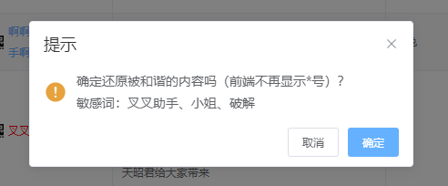

# element this.$confirm确定框内容换行显示

```
    let confirmText = [
        "确定还原被和谐的内容吗（前端不再显示*号）？",
        '敏感词：XXXX'
    ]
    const newDatas = []
    const h = this.$createElement
    for (const i in confirmText) {
      newDatas.push(h("p", null, confirmText[i]))
    }
    this.$confirm("提示", {
      title: "提示",
      message: h("div", null, newDatas),
      showCancelButton: true,
      confirmButtonText: "确定",
      cancelButtonText: "取消",
      type: "warning"
    })
      .then(async () => {
      })
      .catch(error => {
        console.log(error)
      })
```
效果图：


