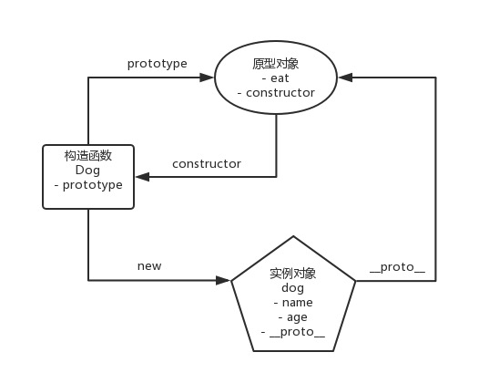
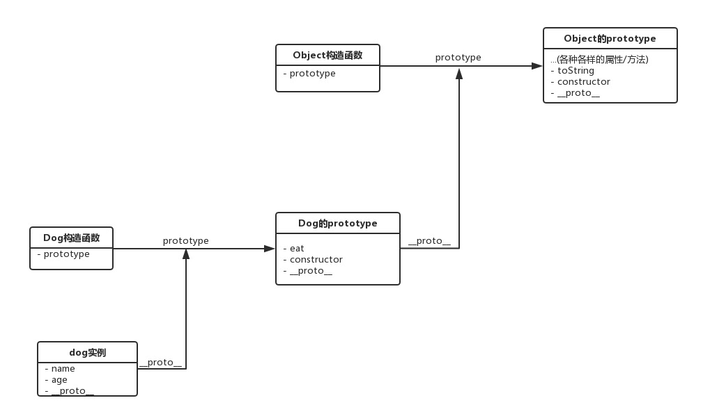

# JS设计模式-创建型

### 这里主要说说：构造器模式，工厂模式-简单工厂，工厂模式-抽象工厂，单例模式，原型模式。

***

## 1.构造器模式

```
function User(name , age, career) {
    this.name = name
    this.age = age
    this.career = career 
}

const user = new User(name, age, career)
```
像 User 这样当新建对象的内存被分配后，用来初始化该对象的特殊函数，就叫做构造器。在 JavaScript 中，我们使用构造函数去初始化对象，就是应用了构造器模式。

在创建一个user过程中，谁变了，谁不变？

很明显，变的是每个user的姓名、年龄、工种这些值，这是用户的个性，不变的是每个员工都具备姓名、年龄、工种这些属性，这是用户的共性。

那么构造器做了什么？

构造器是不是将 name、age、career 赋值给对象的过程封装，确保了每个对象都具备这些属性，确保了共性的不变，同时将 name、age、career 各自的取值操作开放，确保了个性的灵活。

如果在使用构造器模式的时候，我们本质上是去抽象了每个对象实例的变与不变。那么使用工厂模式时，我们要做的就是去抽象不同构造函数（类）之间的变与不变。

***

## 2.简单工厂
```
function User(name , age, career, work) {
    this.name = name
    this.age = age
    this.career = career 
    this.work = work
}

function Factory(name, age, career) {
    let work
    switch(career) {
        case 'coder':
            work =  ['写代码','写系分', '修Bug'] 
            break
        case 'product manager':
            work = ['订会议室', '写PRD', '催更']
            break
        case 'boss':
            work = ['喝茶', '看报', '见客户']
        case 'xxx':
            // 其它工种的职责分配
            ...
            
    return new User(name, age, career, work)
}
```
工厂模式其实就是将创建对象的过程单独封装。它很像我们去餐馆点菜：比如说点一份西红柿炒蛋，我们不用关心西红柿怎么切、怎么打鸡蛋这些菜品制作过程中的问题，我们只关心摆上桌那道菜。在工厂模式里，我传参这个过程就是点菜，工厂函数里面运转的逻辑就相当于炒菜的厨师和上桌的服务员做掉的那部分工作——这部分工作我们同样不用关心，我们只要能拿到工厂交付给我们的实例结果就行了。

总结一下：工厂模式的简单之处，在于它的概念相对好理解：将创建对象的过程单独封装，这样的操作就是工厂模式。同时它的应用场景也非常容易识别：有构造函数的地方，我们就应该想到简单工厂；在写了大量构造函数、调用了大量的 new、自觉非常不爽的情况下，我们就应该思考是不是可以掏出工厂模式重构我们的代码了。

***

## 3.抽象工厂

在实际的业务中，我们往往面对的复杂度并非数个类、一个工厂可以解决，而是需要动用多个工厂。

**开放封闭原则：对拓展开放，对修改封闭。说得更准确点，软件实体（类、模块、函数）可以扩展，但是不可修改。**

大家现在回头对比一下抽象工厂和简单工厂的思路，思考一下：它们之间有哪些异同？

它们的共同点，在于都**尝试去分离一个系统中变与不变的部分**。它们的不同在于**场景的复杂度**。在简单工厂的使用场景里，处理的对象是类，并且是一些非常好对付的类——它们的共性容易抽离，同时因为逻辑本身比较简单，故而不苛求代码可扩展性。抽象工厂本质上处理的其实也是类，但是是一帮非常棘手、繁杂的类，这些类中不仅能划分出门派，还能划分出等级，同时存在着千变万化的扩展可能性——这使得我们必须对共性作更特别的处理、使用抽象类去降低扩展的成本，同时需要对类的性质作划分，于是有了这样的四个关键角色：

**抽象工厂（抽象类，它不能被用于生成具体实例）**： 用于声明最终目标产品的共性。在一个系统里，抽象工厂可以有多个（大家可以想象我们的手机厂后来被一个更大的厂收购了，这个厂里除了手机抽象类，还有平板、游戏机抽象类等等），每一个抽象工厂对应的这一类的产品，被称为“产品族”。

**具体工厂（用于生成产品族里的一个具体的产品）**： 继承自抽象工厂、实现了抽象工厂里声明的那些方法，用于创建具体的产品的类。

**抽象产品（抽象类，它不能被用于生成具体实例）**： 上面我们看到，具体工厂里实现的接口，会依赖一些类，这些类对应到各种各样的具体的细粒度产品（比如操作系统、硬件等），这些具体产品类的共性各自抽离，便对应到了各自的抽象产品类。

**具体产品（用于生成产品族里的一个具体的产品所依赖的更细粒度的产品）**： 比如我们上文中具体的一种操作系统、或具体的一种硬件等。
抽象工厂模式的定义，是围绕一个超级工厂创建其他工厂。本节内容对一些工作年限不多的同学来说可能不太友好，但抽象工厂目前来说在JS世界里也应用得并不广泛，所以大家不必拘泥于细节，只需留意以下三点：

抽象工厂模式的定义，是围绕一个超级工厂创建其他工厂。本节内容对一些工作年限不多的同学来说可能不太友好，但抽象工厂目前来说在JS世界里也应用得并不广泛，所以大家不必拘泥于细节，只需留意以下三点：

    1.学会用 ES6 模拟 JAVA 中的抽象类；
    2.了解抽象工厂模式中四个角色的定位与作用；
    3.对“开放封闭原则”形成自己的理解，知道它好在哪，知道执行它的必要性。

如果能对这三点有所掌握，那么这一节的目的就达到了，最难搞、最难受的抽象工厂也就告一段落了。

***

## 4.单例模式

保证一个类仅有一个实例，并提供一个访问它的全局访问点，这样的模式就叫做单例模式。

### 单例模式的实现思路
现在我们先不考虑单例模式的应用场景，单看它的实现，思考这样一个问题：如何才能保证一个类仅有一个实例？

一般情况下，当我们创建了一个类（本质是构造函数）后，可以通过new关键字调用构造函数进而生成任意多的实例对象。像这样：
```
class SingleDog {
    show() {
        console.log('我是一个单例对象')
    }
}

const s1 = new SingleDog()
const s2 = new SingleDog()

// false
s1 === s2
```
楼上我们先 new 了一个 s1，又 new 了一个 s2，很明显 s1 和 s2 之间没有任何瓜葛，两者是相互独立的对象，各占一块内存空间。而单例模式想要做到的是，不管我们尝试去创建多少次，它都只给你返回第一次所创建的那唯一的一个实例。

要做到这一点，就需要构造函数**具备判断自己是否已经创建过一个实例**的能力。我们现在把这段判断逻辑写成一个静态方法(其实也可以直接写入构造函数的函数体里）：
```
class SingleDog {
    show() {
        console.log('我是一个单例对象')
    }
    static getInstance() {
        // 判断是否已经new过1个实例
        if (!SingleDog.instance) {
            // 若这个唯一的实例不存在，那么先创建它
            SingleDog.instance = new SingleDog()
        }
        // 如果这个唯一的实例已经存在，则直接返回
        return SingleDog.instance
    }
}

const s1 = SingleDog.getInstance()
const s2 = SingleDog.getInstance()

// true
s1 === s2
```
除了楼上这种实现方式之外，getInstance的逻辑还可以用闭包来实现：
```
SingleDog.getInstance = (function() {
    // 定义自由变量instance，模拟私有变量
    let instance = null
    return function() {
        // 判断自由变量是否为null
        if(!instance) {
            // 如果为null则new出唯一实例
            instance = new SingleDog()
        }
        return instance
    }
})()
```
可以看出，在getInstance方法的判断和拦截下，我们不管调用多少次，SingleDog都只会给我们返回一个实例，s1和s2现在都指向这个唯一的实例。

### 生产实践：Vuex中的单例模式

>理解 Vuex 中的 Store

>Vuex 使用单一状态树，用一个对象就包含了全部的应用层级状态。至此它便作为一个“唯一数据源 (SSOT)”而存在。这也意味着，每个应用将仅仅包含一个 store 实例。单一状态树让我们能够直接地定位任一特定的状态片段，在调试的过程中也能轻易地取得整个当前应用状态的快照。 ——Vuex官方文档

在Vue中，组件之间是独立的，组件间通信最常用的办法是 props（限于父组件和子组件之间的通信），稍微复杂一点的（比如兄弟组件间的通信）我们通过自己实现简单的事件监听函数也能解决掉。

但当组件非常多、组件间关系复杂、且嵌套层级很深的时候，这种原始的通信方式会使我们的逻辑变得复杂难以维护。这时最好的做法是将共享的数据抽出来、放在全局，供组件们按照一定的的规则去存取数据，保证状态以一种可预测的方式发生变化。于是便有了 Vuex，这个用来存放共享数据的唯一数据源，就是 Store。

### Vuex如何确保Store的唯一性

我们先来看看如何在项目中引入 Vuex：
```
// 安装vuex插件
Vue.use(Vuex)

// 将store注入到Vue实例中
new Vue({
    el: '#app',
    store
})
```

通过调用Vue.use()方法，我们安装了 Vuex 插件。Vuex 插件是一个对象，它在内部实现了一个 install 方法，这个方法会在插件安装时被调用，从而把 Store 注入到Vue实例里去。也就是说每 install 一次，都会尝试给 Vue 实例注入一个 Store。

在 install 方法里，有一段逻辑和我们楼上的 getInstance 非常相似的逻辑：
```
let Vue // 这个Vue的作用和楼上的instance作用一样
...

export function install (_Vue) {
  // 判断传入的Vue实例对象是否已经被install过Vuex插件（是否有了唯一的state）
  if (Vue && _Vue === Vue) {
    if (process.env.NODE_ENV !== 'production') {
      console.error(
        '[vuex] already installed. Vue.use(Vuex) should be called only once.'
      )
    }
    return
  }
  // 若没有，则为这个Vue实例对象install一个唯一的Vuex
  Vue = _Vue
  // 将Vuex的初始化逻辑写进Vue的钩子函数里
  applyMixin(Vue)
}
```
楼上便是 Vuex 源码中单例模式的实现办法了，套路可以说和我们的getInstance如出一辙。通过这种方式，可以保证一个 Vue 实例（即一个 Vue 应用）只会被 install 一次 Vuex 插件，所以每个 Vue 实例只会拥有一个全局的 Store。

### 相关面试题

### 面试题1: 实现一个 Storage
>实现Storage，使得该对象为单例，基于 localStorage 进行封装。实现方法 setItem(key,value) 和 getItem(key)。

>静态方法版
```
// 定义Storage
class Storage {
    static getInstance() {
        // 判断是否已经new过1个实例
        if (!Storage.instance) {
            // 若这个唯一的实例不存在，那么先创建它
            Storage.instance = new Storage()
        }
        // 如果这个唯一的实例已经存在，则直接返回
        return Storage.instance
    }
    getItem (key) {
        return localStorage.getItem(key)
    }
    setItem (key, value) {
        return localStorage.setItem(key, value)
    }
}

const storage1 = Storage.getInstance()
const storage2 = Storage.getInstance()

storage1.setItem('name', '李雷')
// 李雷
storage1.getItem('name')
// 也是李雷
storage2.getItem('name')

// 返回true
storage1 === storage2
```
>闭包版
```
// 先实现一个基础的StorageBase类，把getItem和setItem方法放在它的原型链上
function StorageBase () {}
StorageBase.prototype.getItem = function (key){
    return localStorage.getItem(key)
}
StorageBase.prototype.setItem = function (key, value) {
    return localStorage.setItem(key, value)
}

// 以闭包的形式创建一个引用自由变量的构造函数
const Storage = (function(){
    let instance = null
    return function(){
        // 判断自由变量是否为null
        if(!instance) {
            // 如果为null则new出唯一实例
            instance = new StorageBase()
        }
        return instance
    }
})()

// 这里其实不用 new Storage 的形式调用，直接 Storage() 也会有一样的效果 
const storage1 = new Storage()
const storage2 = new Storage()

storage1.setItem('name', '李雷')
// 李雷
storage1.getItem('name')
// 也是李雷
storage2.getItem('name')

// 返回true
storage1 === storage2
```

### 面试题2: 实现一个全局的模态框
>实现一个全局唯一的Modal弹框

```
<!DOCTYPE html>
<html lang="en">
<head>
    <meta charset="UTF-8">
    <title>单例模式弹框</title>
</head>
<style>
    #modal {
        height: 200px;
        width: 200px;
        line-height: 200px;
        position: fixed;
        left: 50%;
        top: 50%;
        transform: translate(-50%, -50%);
        border: 1px solid black;
        text-align: center;
    }
</style>
<body>
	<button id='open'>打开弹框</button>
	<button id='close'>关闭弹框</button>
</body>
<script>
    // 核心逻辑，这里采用了闭包思路来实现单例模式
    const Modal = (function() {
    	let modal = null
    	return function() {
            if(!modal) {
            	modal = document.createElement('div')
            	modal.innerHTML = '我是一个全局唯一的Modal'
            	modal.id = 'modal'
            	modal.style.display = 'none'
            	document.body.appendChild(modal)
            }
            return modal
    	}
    })()
    
    // 点击打开按钮展示模态框
    document.getElementById('open').addEventListener('click', function() {
        // 未点击则不创建modal实例，避免不必要的内存占用;此处不用 new Modal 的形式调用也可以，和 Storage 同理
    	const modal = new Modal()
    	modal.style.display = 'block'
    })
    
    // 点击关闭按钮隐藏模态框
    document.getElementById('close').addEventListener('click', function() {
    	const modal = new Modal()
    	if(modal) {
    	    modal.style.display = 'none'
    	}
    })
</script>
</html>
```
***

## 5.原型模式

>原型模式不仅是一种设计模式，它还是一种编程范式（programming paradigm），是 JavaScript 面向对象系统实现的根基。

在原型模式下，当我们想要创建一个对象时，会先找到一个对象作为原型，然后通过克隆原型的方式来创建出一个与原型一样（共享一套数据/方法）的对象。在 JavaScript 里，Object.create方法就是原型模式的天然实现——准确地说，只要我们还在借助<font color=#ff502c >Prototype</font>来实现对象的创建和原型的继承，那么我们就是在应用原型模式。

有的设计模式资料中会强调，原型模式就是拷贝出一个新对象，认为在 JavaScript 类里实现了深拷贝方法才算是应用了原型模式。这是非常典型的对 JAVA/C++ 设计模式的生搬硬套，更是对 JavaScript 原型模式的一种误解。事实上，在JAVA中，确实存在原型模式相关的克隆接口规范。但在 JavaScript 中，我们使用原型模式，并不是为了得到一个副本，而是为了得到与构造函数（类）相对应的类型的实例、实现数据/方法的共享。克隆是实现这个目的的方法，但克隆本身并不是我们的目的。

### 以类为中心的语言 vs 以原型为中心的语言

JavaScript 这门语言的根本就是原型模式。在 Java 等强类型语言中，原型模式的出现是为了实现类型之间的解耦。而 JavaScript 本身类型就比较模糊，不存在类型耦合的问题，所以说咱们平时根本不会刻意地去使用原型模式。因此我们此处不必强行把原型模式当作一种设计模式去理解，把它作为一种编程范式来讨论会更合适。

### 谈原型模式，其实是谈原型范式

原型编程范式的核心思想就是**利用实例来描述对象，用实例作为定义对象和继承的基础**。在 JavaScript 中，原型编程范式的体现就是**基于原型链的继承**。这其中，对原型、原型链的理解是关键。

### 原型

在 JavaScript 中，每个构造函数都拥有一个<font color=#ff502c>prototype</font>属性，它指向构造函数的原型对象，这个原型对象中有一个 construtor 属性指回构造函数；每个实例都有一个__proto__属性，当我们使用构造函数去创建实例时，实例的__proto__属性就会指向构造函数的原型对象。

具体来说，当我们这样使用构造函数创建一个对象时：
```
// 创建一个Dog构造函数
function Dog(name, age) {
  this.name = name
  this.age = age
}

Dog.prototype.eat = function() {
  console.log('肉骨头真好吃')
}

// 使用Dog构造函数创建dog实例
const dog = new Dog('旺财', 3)
```
这段代码里的几个实体之间就存在着这样的关系：



### 原型链

现在我在上面那段代码的基础上，进行两个方法调用:
```
// 输出"肉骨头真好吃"
dog.eat()

// 输出"[object Object]"
dog.toString()
```
明明没有在 dog 实例里手动定义 eat 方法和 toString 方法，它们还是被成功地调用了。这是因为当我试图访问一个 JavaScript 实例的属性/方法时，它首先搜索这个实例本身；当发现实例没有定义对应的属性/方法时，它会转而去搜索实例的原型对象；如果原型对象中也搜索不到，它就去搜索原型对象的原型对象，这个搜索的轨迹，就叫做原型链。

以我们的 eat 方法和 toString 方法的调用过程为例，它的搜索过程就是这样子的：



楼上这些彼此相连的prototype，就组成了一个原型链。 注： 几乎所有 JavaScript 中的对象都是位于原型链顶端的 Object 的实例，除了Object.prototype（当然，如果我们手动用Object.create(null)创建一个没有任何原型的对象，那它也不是 Object 的实例）。

以上为大家介绍了原型、原型链等 JavaScript 中核心的基础知识。这些不仅是基础中的基础，也是面试中的重点。此外在面试中，一些面试官可能会刻意混淆 JavaScript 中原型范式和强类型语言中原型模式的区别，当他们这么做的时候不一定是因为对语言、对设计模式的理解有问题，而很有可能是为了考察你对象的深拷贝。

### 对象的深拷贝

实现 JavaScript 中的深拷贝，有一种非常取巧的方式 —— JSON.stringify.

但是注意，这个方法存在一些局限性，比如无法处理 function、无法处理正则等等——只有当你的对象是一个严格的 JSON 对象时，可以顺利使用这个方法。在面试过程中，大家答出这个答案没有任何问题，但不要仅仅答这一种做法。

**深拷贝没有完美方案，每一种方案都有它的边界 case**。而面试官向你发问也并非是要求你破解人类未解之谜，多数情况下，他只是希望考查你对递归的熟练程度。所以递归实现深拷贝的核心思路，大家需要重点掌握（解析在注释里）：
```
function deepClone(obj) {
    // 如果是 值类型 或 null，则直接return
    if(typeof obj !== 'object' || obj === null) {
        return obj
    }
    
    // 定义结果对象
    let copy = {}
    
    // 如果对象是数组，则定义结果数组
    if(obj.constructor === Array) {
        copy = []
    }
    
    // 遍历对象的key
    for(let key in obj) {
        // 如果key是对象的自有属性
        if(obj.hasOwnProperty(key)) {
            // 递归调用深拷贝方法
            copy[key] = deepClone(obj[key])
        }
    }
    
    return copy
} 
```

调用深拷贝方法，若属性为值类型，则直接返回；若属性为引用类型，则递归遍历。这就是我们在解这一类题时的核心的方法。

深拷贝在命题时，可发挥的空间主要在于针对不同数据结构的处理，比如除了考虑 Array、Object，还需要考虑一些其它的数据结构（Map、Set 等）；此外还有一些极端 case（循环引用等）的处理等等。