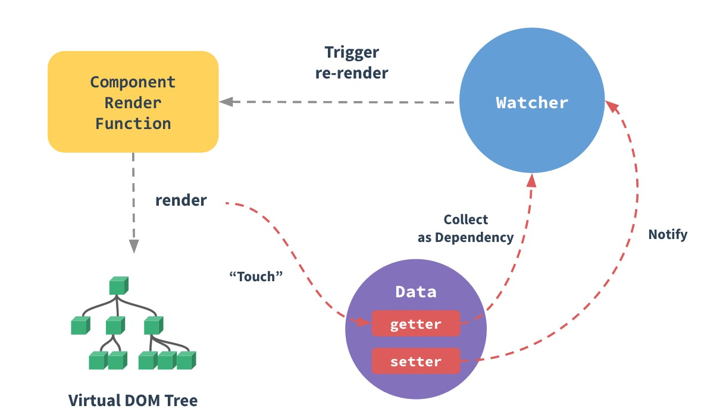
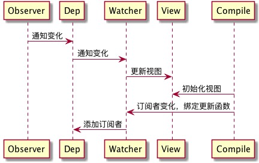
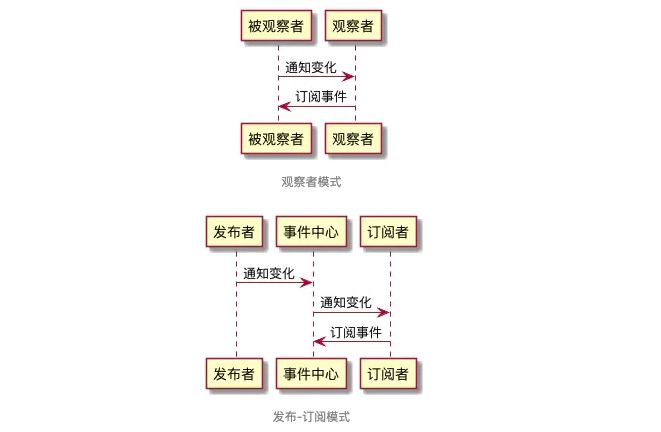

# JS设计模式-行为型

### 这里主要说说：观察者模式，策略模式，状态模式，迭代器模式。

***

## 1.观察者模式
>观察者模式定义了一种一对多的依赖关系，让多个观察者对象同时监听某一个目标对象，当这个目标对象的状态发生变化时，会通知所有观察者对象，使它们能够自动更新。 —— Graphic Design Patterns

观察者模式有一个“别名”，叫发布 - 订阅模式（之所以别名加了引号，是因为两者之间存在着细微的差异）。这个别名非常形象地诠释了观察者模式里两个核心的角色要素——“发布者”与“订阅者”。

### 例子

在观察者模式里，至少应该有两个关键角色是一定要出现的——发布者和订阅者。用面向对象的方式表达的话，那就是要有两个类。

发布者的类 - 增加订阅者，通知订阅者，移除订阅者

订阅者 - 被通知、去执行（本质上是接受发布者的调用）
***
### Vue数据双向绑定（响应式系统）的实现原理

Vue 框架是热门的渐进式 JavaScript框架。在 Vue 中，当我们修改状态时，视图会随之更新，这就是Vue的数据双向绑定（又称响应式原理）。数据双向绑定是Vue 最独特的特性之一。强烈建议阅读[Vue官方对响应式原理的介绍](https://cn.vuejs.org/v2/guide/reactivity.html)。此处我们用官方的一张流程图来简要地说明一下Vue响应式系统的整个流程：



在 Vue 中，每个组件实例都有相应的 watcher 实例对象，它会在组件渲染的过程中把属性记录为依赖，之后当依赖项的 setter 被调用时，会通知 watcher 重新计算，从而致使它关联的组件得以更新——这是一个典型的观察者模式。

在Vue数据双向绑定的实现逻辑里，有这样三个关键角色：

* observer（监听器）：注意，此 observer 非彼 observer。在我们上节的解析中，observer 作为设计模式中的一个角色，代表“订阅者”。但在Vue数据双向绑定的角色结构里，所谓的 observer 不仅是一个数据监听器，它还需要对监听到的数据进行**转发**——也就是说它**同时还是一个发布者**。
* watcher（订阅者）：observer 把数据转发给了**真正的订阅者**——watcher对象。watcher 接收到新的数据后，会去更新视图。
* compile（编译器）：MVVM 框架特有的角色，负责对每个节点元素指令进行扫描和解析，指令的数据初始化、订阅者的创建这些“杂活”也归它管~

这三者的配合过程如图所示：



OK，实现方案搞清楚了，下面我们给整个流程中涉及到发布-订阅这一模式的代码来个特写：

**核心代码**

**实现observer**

首先我们需要实现一个方法，这个方法会对需要监听的数据对象进行遍历、给它的属性加上定制的 getter 和 setter 函数。这样但凡这个对象的某个属性发生了改变，就会触发 setter 函数，进而通知到订阅者。这个 setter 函数，就是我们的监听器：
```
// observe方法遍历并包装对象属性
function observe(target) {
    // 若target是一个对象，则遍历它
    if(target && typeof target === 'object') {
        Object.keys(target).forEach((key)=> {
            // defineReactive方法会给目标属性装上“监听器”
            defineReactive(target, key, target[key])
        })
    }
}

// 定义defineReactive方法
function defineReactive(target, key, val) {
    // 属性值也可能是object类型，这种情况下需要调用observe进行递归遍历
    observe(val)
    // 为当前属性安装监听器
    Object.defineProperty(target, key, {
         // 可枚举
        enumerable: true,
        // 不可配置
        configurable: false, 
        get: function () {
            return val;
        },
        // 监听器函数
        set: function (value) {
            console.log(`${target}属性的${key}属性从${val}值变成了了${value}`)
            val = value
        }
    });
}
```
下面实现订阅者 Dep：
```
// 定义订阅者类Dep
class Dep {
    constructor() {
        // 初始化订阅队列
        this.subs = []
    }
    
    // 增加订阅者
    addSub(sub) {
        this.subs.push(sub)
    }
    
    // 通知订阅者（是不是所有的代码都似曾相识？）
    notify() {
        this.subs.forEach((sub)=>{
            sub.update()
        })
    }
}
```
现在我们可以改写 defineReactive 中的 setter 方法，在监听器里去通知订阅者了：
```
function defineReactive(target, key, val) {
    const dep = new Dep()
    // 监听当前属性
    observe(val)
    Object.defineProperty(target, key, {
        set: (value) => {
            // 通知所有订阅者
            dep.notify()
        }
    })
}
```
***
### 实现一个Event Bus/ Event Emitter

Event Bus（Vue、Flutter 等前端框架中有出镜）和 Event Emitter（Node中有出镜）出场的“剧组”不同，但是它们都对应一个共同的角色——全局事件总线。
全局事件总线，严格来说不能说是观察者模式，而是发布-订阅模式（具体的概念甄别我们会在下个小节着重讲）。它在我们日常的业务开发中应用非常广。

**在Vue中使用Event Bus来实现组件间的通讯**

Event Bus/Event Emitter 作为全局事件总线，它起到的是一个沟通桥梁的作用。我们可以把它理解为一个事件中心，我们所有事件的订阅/发布都不能由订阅方和发布方“私下沟通”，必须要委托这个事件中心帮我们实现。

在Vue中，有时候 A 组件和 B 组件中间隔了很远，看似没什么关系，但我们希望它们之间能够通信。这种情况下除了求助于 Vuex 之外，我们还可以通过 Event Bus 来实现我们的需求。

创建一个 Event Bus（本质上也是 Vue 实例）并导出：
```
const EventBus = new Vue()
export default EventBus
```
在主文件里引入EventBus，并挂载到全局：
```
import bus from 'EventBus的文件路径'
Vue.prototype.bus = bus
```
订阅事件：
```
// 这里func指someEvent这个事件的监听函数
this.bus.$on('someEvent', func)
```
发布（触发）事件：
```
// 这里params指someEvent这个事件被触发时回调函数接收的入参
this.bus.$emit('someEvent', params)
```
整个调用过程中，没有出现具体的发布者和订阅者（比如上节的PrdPublisher和DeveloperObserver），全程只有bus这个东西一个人在疯狂刷存在感。这就是全局事件总线的特点——所有事件的发布/订阅操作，必须经由事件中心，禁止一切“私下交易”！

下面，我们就一起来实现一个Event Bus（注意看注释里的解析）：
```
class EventEmitter {
  constructor() {
    // handlers是一个map，用于存储事件与回调之间的对应关系
    this.handlers = {}
  }

  // on方法用于安装事件监听器，它接受目标事件名和回调函数作为参数
  on(eventName, cb) {
    // 先检查一下目标事件名有没有对应的监听函数队列
    if (!this.handlers[eventName]) {
      // 如果没有，那么首先初始化一个监听函数队列
      this.handlers[eventName] = []
    }

    // 把回调函数推入目标事件的监听函数队列里去
    this.handlers[eventName].push(cb)
  }

  // emit方法用于触发目标事件，它接受事件名和监听函数入参作为参数
  emit(eventName, ...args) {
    // 检查目标事件是否有监听函数队列
    if (this.handlers[eventName]) {
      // 如果有，则逐个调用队列里的回调函数
      this.handlers[eventName].forEach((callback) => {
        callback(...args)
      })
    }
  }

  // 移除某个事件回调队列里的指定回调函数
  off(eventName, cb) {
    const callbacks = this.handlers[eventName]
    const index = callbacks.indexOf(cb)
    if (index !== -1) {
      callbacks.splice(index, 1)
    }
  }

  // 为事件注册单次监听器
  once(eventName, cb) {
    // 对回调函数进行包装，使其执行完毕自动被移除
    const wrapper = (...args) => {
      cb.apply(...args)
      this.off(eventName, wrapper)
    }
    this.on(eventName, wrapper)
  }
}
```

在日常的开发中，大家用到EventBus/EventEmitter往往提供比这五个方法多的多的多的方法。但在面试过程中，如果大家能够完整地实现出这五个方法，已经非常可以说明问题了.
***

### 观察者模式与发布-订阅模式的区别是什么？

在面试过程中，一些对细节比较在意的面试官可能会追问观察者模式与发布-订阅模式的区别。这个问题可能会引发一些同学的不适，因为在大量参考资料以及已出版的纸质书籍中，都会告诉大家“发布-订阅模式和观察者模式是同一个东西的两个名字”。本书在前文的叙述中，也没有突出强调两者的区别。其实这两个模式，要较起真来，确实不能给它们划严格的等号。

为什么大家都喜欢给它们强行划等号呢？这是因为就算划了等号，也不影响我们正常使用，毕竟两者在核心思想、运作机制上没有本质的差别。但考虑到这个问题确实可以成为面试题的一个方向，此处我们还是单独拿出来讲一下。

回到我们上文的例子里。韩梅梅把所有的开发者拉了一个群，直接把需求文档丢给每一位群成员，这种**发布者直接触及到订阅者**的操作，叫观察者模式。但如果韩梅梅没有拉群，而是把需求文档上传到了公司统一的需求平台上，需求平台感知到文件的变化、自动通知了每一位订阅了该文件的开发者，这种**发布者不直接触及到订阅者、而是由统一的第三方来完成实际的通信的操作，叫做发布-订阅模式**。

相信大家也已经看出来了，观察者模式和发布-订阅模式之间的区别，在于是否存在第三方、发布者能否直接感知订阅者（如图所示）。



在我们见过的这些例子里，韩梅梅拉钉钉群的操作，就是典型的观察者模式；而通过EventBus去实现事件监听/发布，则属于发布-订阅模式。

既生瑜，何生亮？既然有了观察者模式，为什么还需要发布-订阅模式呢？

大家思考一下：为什么要有观察者模式？观察者模式，解决的其实是模块间的耦合问题，有它在，即便是两个分离的、毫不相关的模块，也可以实现数据通信。但观察者模式仅仅是减少了耦合，**并没有完全地解决耦合问题**——被观察者必须去维护一套观察者的集合，这些观察者必须实现统一的方法供被观察者调用，两者之间还是有着说不清、道不明的关系。

而发布-订阅模式，则是快刀斩乱麻了——发布者完全不用感知订阅者，不用关心它怎么实现回调方法，事件的注册和触发都发生在独立于双方的第三方平台（事件总线）上。发布-订阅模式下，实现了完全地解耦。

但这并不意味着，发布-订阅模式就比观察者模式“高级”。在实际开发中，我们的模块解耦诉求**并非总是需要它们完全解耦**。如果两个模块之间本身存在关联，且这种关联是稳定的、必要的，那么我们使用观察者模式就足够了。而在模块与模块之间独立性较强、且没有必要单纯为了数据通信而强行为两者制造依赖的情况下，我们往往会倾向于使用发布-订阅模式。

***

## 2.策略模式
>定义一系列的算法,把它们一个个封装起来, 并且使它们可相互替换。

实际就是用对象键值对处理ifelse。

***

## 3.状态模式
>状态模式(State Pattern) ：允许一个对象在其内部状态改变时改变它的行为，对象看起来似乎修改了它的类。

>状态模式主要解决的是当控制一个对象状态的条件表达式过于复杂时的情况。把状态的判断逻辑转移到表示不同状态的一系列类中，可以把复杂的判断逻辑简化。

状态模式和策略模式宛如一对孪生兄弟——它们长得很像、解决的问题也可以说没啥本质上的差别。

唯一的区别在于，定义里强调了”类“的概念。但我们的示例中，包括大家今后的实践中，一个对象的状态如果复杂到了你不得不给它的每 N 种状态划分为一类、一口气划分很多类这种程度，我更倾向于你去反思一个这个对象是不是做太多事情了。事实上，在大多数场景下，我们的行为划分，都是可以像本节一样，控制在”函数“这个粒度的。

**策略与状态的辨析**

怎么理解这个问题？大家知道，策略模式是对算法的封装。算法和状态对应的行为函数虽然本质上都是行为，但是算法的独立性可高多了。

比如说我一个询价算法，我只需要读取一个数字，我就能啪啪三下五除二给你吐出另一个数字作为返回结果——它和计算主体之间可以是分离的，我们只要关注计算逻辑本身就可以了。

但状态可不一样了。拿咱们咖啡机来说，为了好懂，咱写代码的时候把真正咖啡的制作工序用 console 来表示了。但大家都知道，做咖啡要考虑的东西可太多了。 比如咱们做拿铁，拿铁里的牛奶从哪来，是不是从咖啡机的某个储物空间里去取？再比如我们行为函数是不是应该时刻感知咖啡机每种原材料的用量、进而判断自己的工序还能不能如期执行下去？这就决定了行为函数必须能很方便地拿到咖啡机这个主体的各种信息——它必须得对主体有感知才行。

策略模式和状态模式确实是相似的，它们都封装行为、都通过委托来实现行为分发。
但策略模式中的行为函数是”潇洒“的行为函数，它们不依赖调用主体、互相平行、各自为政，井水不犯河水。而状态模式中的行为函数，首先是和状态主体之间存在着关联，由状态主体把它们串在一起；另一方面，正因为关联着同样的一个（或一类）主体，所以不同状态对应的行为函数可能并不会特别割裂。

***

## 4.迭代器模式
>迭代器模式提供一种方法顺序访问一个聚合对象中的各个元素，而又不暴露该对象的内部表示。 ——《设计模式：可复用面向对象软件的基础》

迭代器模式是设计模式中少有的目的性极强的模式。所谓“目的性极强”就是说它不操心别的，它就解决这一个问题——遍历。

## “公元前”的迭代器模式

遍历作为一种合理、高频的使用需求，几乎没有语言会要求它的开发者手动去实现。在JS中，本身也内置了一个比较简陋的数组迭代器的实现——Array.prototype.forEach。

通过调用forEach方法，我们可以轻松地遍历一个数组：
```
const arr = [1, 2, 3]
arr.forEach((item, index)=>{
    console.log(`索引为${index}的元素是${item}`)
})
```

但forEach方法并不是万能的，比如下面这种场景：
```
const aNodes = document.getElementsByTagName('a')
```
aNodes看上去多么像一个数组啊！但当你尝试用数组的原型方法去遍历它时,你发现报错了。(这里补充一下，document.querySelectorAll()获取的dom，可以使用forEach，因为这个API返回的是对象，而不是ArrayLike。)

震惊，原来这个aNodes是个假数组！准确地说，它是一个类数组对象，并没有为你实现好用的forEach方法。也就是说，要想实现类数组的遍历，你得另请高明。

现在问题就出现了：普通数组是不是集合？是！aNodes是不是集合？是！同样是集合，同样有遍历需求，我们却要针对不同的数据结构执行不同的遍历手段，好累！再回头看看迭代器的定义是什么——遍历集合的同时，我们**不需要关心集合的内部结构**。而forEach只能做到允许我们不关心数组这一种集合的内部结构，看来想要一套统一的遍历方案，我们非得请出一个**更强的通用迭代器**不可了。

这个“公元前”怎么定义呢？其实它说的就是ES标准内置迭代器之前的那些日子——差不多四五年之前，彼时还没有这么多轮子，jQuery风头正盛。jQuery这个库其实是非常优秀的，至少jQuery里有太多优秀的设计模式可以拿来考考你。就包括咱们当年想用一个真·迭代器又不想自己搞的时候，也是请jQuery实现的迭代器来帮忙：

借助jQuery的each方法，我们可以用同一套遍历规则遍历不同的集合对象：
```
const arr = [1, 2, 3]
const aNodes = document.getElementsByTagName('a')

$.each(arr, function (index, item) {
  console.log(`数组的第${index}个元素是${item}`)
})

$.each(aNodes, function (index, aNode) {
  console.log(`DOM类数组的第${index}个元素是${aNode.innerText}`)
})
```
可以看出，jQuery的迭代器为我们统一了不同类型集合的遍历方式，使我们在访问集合内每一个成员时不用去关心集合本身的内部结构以及集合与集合间的差异，这就是迭代器存在的价值~

## ES6对迭代器的实现

在“公元前”，JS原生的集合类型数据结构，只有Array（数组）和Object（对象）；而ES6中，又新增了Map和Set。四种数据结构各自有着自己特别的内部实现，但我们仍期待以同样的一套规则去遍历它们，所以ES6在推出新数据结构的同时也推出了一套**统一的接口机制**——迭代器（Iterator）。

ES6约定，任何数据结构只要具备Symbol.iterator属性（这个属性就是Iterator的具体实现，它本质上是当前数据结构默认的迭代器生成函数），就可以被遍历——准确地说，是被for...of...循环和迭代器的next方法遍历。 事实上，for...of...的背后正是对next方法的反复调用。

在ES6中，针对Array、Map、Set、String、TypedArray、函数的 arguments 对象、NodeList 对象这些原生的数据结构都可以通过for...of...进行遍历。原理都是一样的，此处我们拿最简单的数组进行举例，当我们用for...of...遍历数组时：
```
const arr = [1, 2, 3]
const len = arr.length
for(item of arr) {
    console.log(`当前元素是${item}`)
}
```
之所以能够按顺序一次一次地拿到数组里的每一个成员，是因为我们借助数组的Symbol.iterator生成了它对应的迭代器对象，通过反复调用迭代器对象的next方法访问了数组成员，像这样：
```
const arr = [1, 2, 3]
// 通过调用iterator，拿到迭代器对象
const iterator = arr[Symbol.iterator]()

// 对迭代器对象执行next，就能逐个访问集合的成员
iterator.next()
iterator.next()
iterator.next()
```
丢进控制台，我们可以看到next每次会按顺序帮我们访问一个集合成员：
```
const arr = [1, 2, 3]
// 通过调用iterator，拿到迭代器对象
const iterator = arr[Symbol.iterator]()
undefined
iterator.next()
//console: {value: 1, done: false}
iterator.next()
//console:  {value: 2, done: false}
iterator.next()
//console:  {value: 3, done: false}
```
而for...of...做的事情，基本等价于下面这通操作：
```
// 通过调用iterator，拿到迭代器对象
const iterator = arr[Symbol.iterator]()

// 初始化一个迭代结果
let now = { done: false }

// 循环往外迭代成员
while(!now.done) {
    now = iterator.next()
    if(!now.done) {
        console.log(`现在遍历到了${now.value}`)
    }
}
```
可以看出，for...of...其实就是iterator循环调用换了种写法。在ES6中我们之所以能够开心地用for...of...遍历各种各种的集合，全靠迭代器模式在背后给力。

## 实现一个迭代器生成函数

我们说迭代器对象全凭迭代器生成函数帮我们生成。在ES6中，实现一个迭代器生成函数并不是什么难事儿，因为ES6早帮我们考虑好了全套的解决方案，内置了贴心的生成器（Generator）供我们使用：
```
// 编写一个迭代器生成函数
function *iteratorGenerator() {
    yield '1号选手'
    yield '2号选手'
    yield '3号选手'
}

const iterator = iteratorGenerator()

iterator.next()
iterator.next()
iterator.next()
```
写一个生成器函数并没有什么难度，但在面试的过程中，面试官往往对生成器这种语法糖背后的实现逻辑更感兴趣。下面我们要做的，不仅仅是写一个迭代器对象，而是用ES5去写一个能够生成迭代器对象的迭代器生成函数（解析在注释里）：
```
// 定义生成器函数，入参是任意集合
function iteratorGenerator(list) {
    // idx记录当前访问的索引
    var idx = 0
    // len记录传入集合的长度
    var len = list.length
    return {
        // 自定义next方法
        next: function() {
            // 如果索引还没有超出集合长度，done为false
            var done = idx >= len
            // 如果done为false，则可以继续取值
            var value = !done ? list[idx++] : undefined
            
            // 将当前值与遍历是否完毕（done）返回
            return {
                done: done,
                value: value
            }
        }
    }
}

var iterator = iteratorGenerator(['1号选手', '2号选手', '3号选手'])
iterator.next()
iterator.next()
iterator.next()
```
此处为了记录每次遍历的位置，我们实现了一个闭包，借助自由变量来做我们的迭代过程中的“游标”。

## 小结

迭代器模式比较特别，它非常重要，重要到语言和框架都争着抢着帮我们实现。但也正因为如此，大家业务开发中需要手动写迭代器的场景几乎没有，所以很少有同学会去刻意留意迭代器模式、思考它背后的实现机制。通过阅读本节，希望大家可以领略迭代器模式的妙处（为什么会有，为什么要用）和迭代器模式的实现思路（方便面试）。